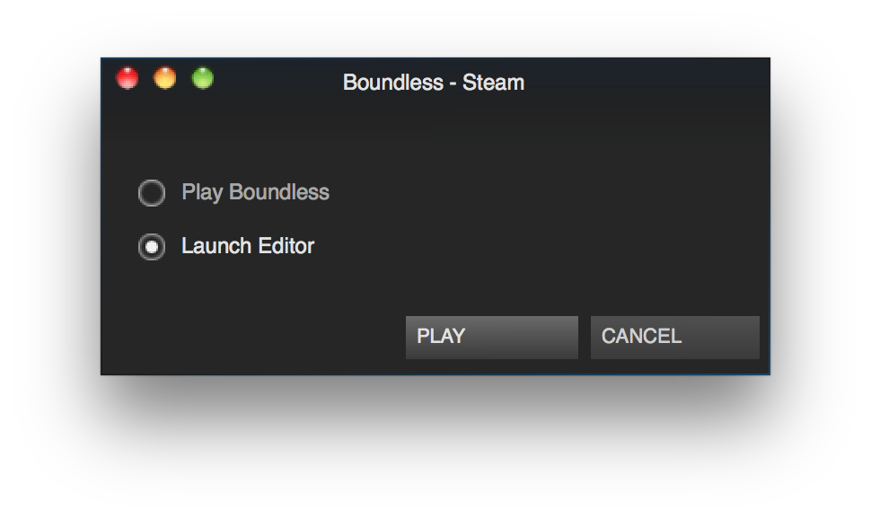

By the end of this tutorial, you will know how to navigate the world builder and build a basic world.  The end result may not be all that much to look at, but that's so that we can move on to the better stuff in the following tutorials!  So, please, bear with it - this tutorial won't take that long.

# A Blank Canvas

First step: open the world builder!  You can launch it via steam by clicking play on boundless and choosing "Launch Editor".

