By the end of this tutorial, you will know how to navigate the world builder, understand its core concepts, and have built a _very_ basic world.

The end result may not be all that much to look at, but that's so that we can move on to the better stuff in the following tutorials!  So, please, bear with it - this first tutorial won't take that long.

# A Blank Canvas

The first step on your journey is to open the world builder and start a new world.

You can launch it via steam by clicking play on boundless and choosing "Launch Editor".  You'll see a bleak, blank, and black canvas - but not to worry; click on "New World" in the menu.  After pressing OK to the dire-sounding alert, you'll be greeted with the beginning of your very own Boundless world:

..center
  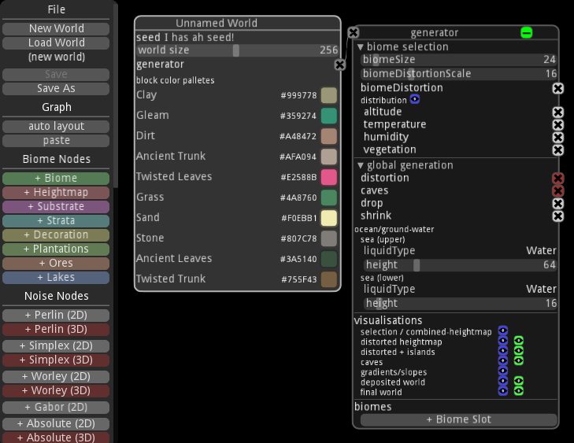

Go ahead and save your world somewhere by clicking on "Save As" in the menu.  After saving it the first time, the world builder will periodically save backups.  Always remember to do this - the world builder _does_ crash from time to time.

## Orientation

Let's start with a little terminology:

**Node:** The world builder expresses a world's configuration via _nodes_.  Each node configures a particular aspect of the world, and is visualized by a box in the world builder's canvas.

**Output:** Every node (except the world node) has an output, represented by a filled circle at the top left of the node.  The color of the circle determines the kind of node or value being outputted (2d noise, 3d noise, biome, etc).

**Input:** Many nodes accept inputs from other nodes, which are represented by filled circles along the right side of a node.  These are also colored to match the kind of node or value that the input accepts.

**Connection:** Connections between nodes are represented by lines between a node's input and another node's output.

**Child Node:** Any node connected to the input of another node is considered a child of that node.

..center
  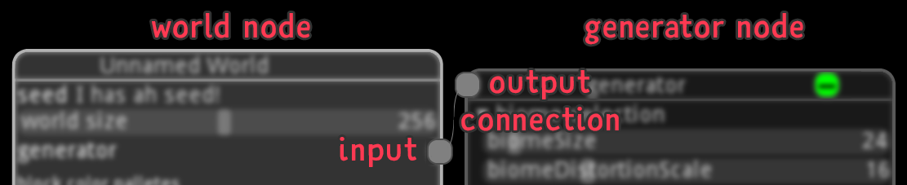

To put this in context, your current world has two nodes: the world node ("Unnamed World"), and a generator node ("generator").  There is a connection between the output of the generator node, and the world node's "generator" input.  The generator node is a child of the world node.

## Managing Nodes

Since you'll be spending most of your time in the world builder playing with various nodes, let's make sure you know all the dirty secrets of nodes.

### Creating Nodes

Nearly every button in the world builder's menu creates a node.  Note that nodes are grouped by category (biome, noise, instanced features, etc), and that each node is colored by its type.

### Renaming Nodes

You can rename any node by right clicking on its title.  Giving nodes custom names is extremely helpful, especially when you have complicated graphs of them!  Feel free to rename with wild abandon.

### Positioning Nodes

The world builder lets you move nodes wherever you like: Simply drag them via their title.

However, manually organizing nodes can quickly become a hassle.  The world builder also provides a very helpful auto layout feature.  When you have a node selected (by clicking its title), pressing "auto layout" in the menu will cause all child nodes connected to it to fit to columns.

Give it a try: Drag the generator node somewhere, select the world node, and click "auto layout".

### Collapsing Nodes

You can also collapse nodes by clicking the green minus button in its title.  This will hide all but the node's title.  It will also hide its child nodes.  Very handy for focusing on some portion of your world!

### Deleting Nodes

Clicking the red x button in the title of a node will delete it (after prompting you).

ctrl-clicking the delete button will delete a node _and its child nodes_.  Very handy, but also very easy to do on accident!

### Deleting Connections

Ctrl-click on a connection's input or output to delete it.  Holding ctrl-, will display an x on inputs/outputs.

### Creating Connections

Click on an input/output, and then click on the corresponding input/output that you wish to connect to.  Easy!

### Copy/Paste

To copy a node, _and all its children_, press the magenta C button in its title.  You can then paste that node (and children) by pressing "paste" in the menu.

# Your First Biome

Huzzah!  Now that all that's over with, let's start building.

Click on the green "+ Biome" button in the menu to create a new biome node.  Let's speculatively rename it to "forest" (even if we won't get around to generating trees in this tutorial).

Next, we need to connect it to your world.  Click on the grey "+ Biome Slot" button at the bottom of the generator node.  This will reveal a new (green) biome input for the generator node.  Finally, connect the biome's output to this input.  Your nodes should look like this:

..center
  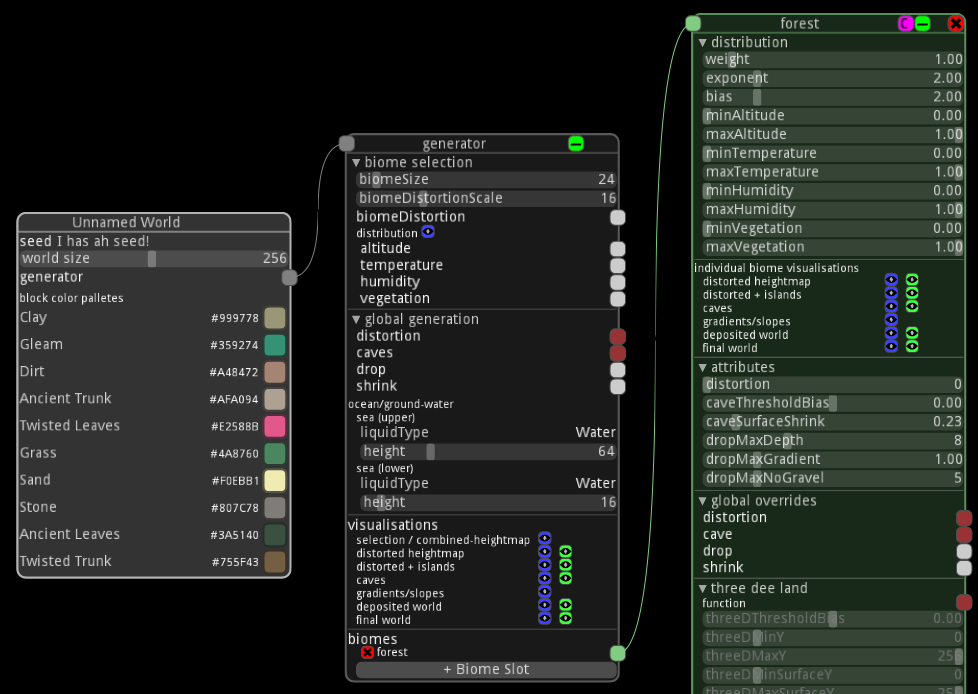

## A Heightmap

Currently, your biome is just a big ocean, which is pretty boring.  Let's create some rolling hills!

Click on the brown "+ Heightmap" button in the menu to create a new heightmap node.  Connect it to the heightmap input of the forest biome.  Additionally, click on the grey "+ Perlin (2D)" button in the menu to create a new 2d Perlin noise node.  Connect that to the noise input of the heightmap node.  It should look like this:

..center
  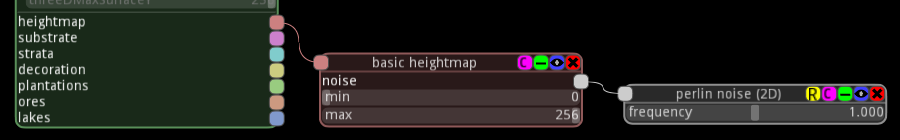

A little explanation is in order, methinks.

### Noise? I Don't Hear Anything!

We'll [dive further into noise](/world-builder/guide/noise) later, but here's a quick TL;DR:

A noise node is effectively a mathematical formula that generates semi-random values in 2 or 3 dimensions.  Each type of noise node generates these values differently (according to the underlying math).  The world builder uses these noise nodes as the basis for pretty much everything it generates.

In the case of our heightmap, we connected a perlin noise node to it, which generates smooth gradients between high and low points at random.  TL;DR!?!¡ - it generates peaks and valleys, and smooth transitions between them.

You can preview this yourself by clicking the blue eye button in the title of the perlin noise node.  You should see something like this:

..center
  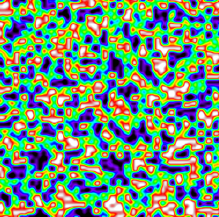

Trippy, eh?  The colors represent the value of the noise function.  From high to low: white, red, orange, yellow, green, blue, purple, black.

Keep that blue eye button in mind!  It is very helpful when understanding what a noise function does, and to preview your changes without regenerating the entire world.

### Viewing Your Terrain

To better understand what's going on here, let's preview the actual terrain that will be generated for our biome.  You can do this by clicking on the blue eye icon next to "distorted heightmap" in the biome node.  Another preview window will pop up that displays your terrain in 3d.

You will want to adjust the camera in that preview window.  You can rotate by dragging with the left mouse button, and use the scroll wheel to zoom in and out.  Try to get a decent overview of the terrain; something like this:

..center
  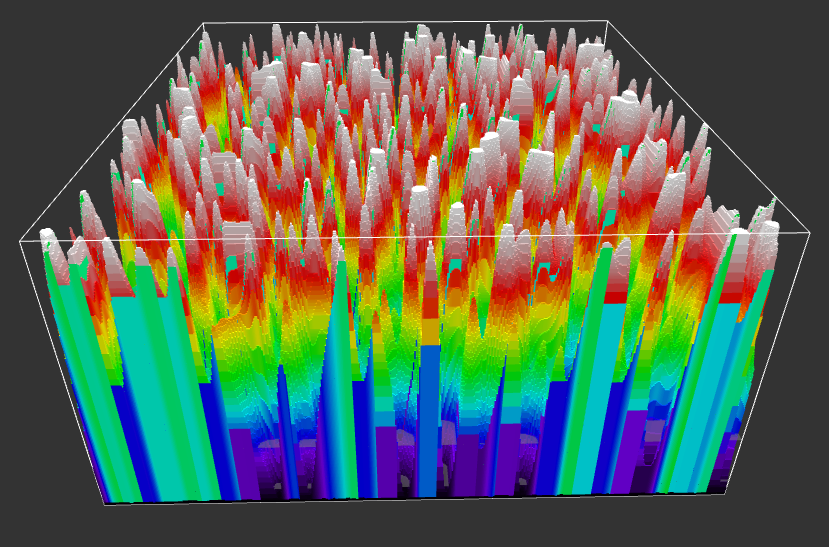

Yeah, that's spiky as hell.  Let's fix it.

## Making Some Hills

First, arrange your windows so that you can view the terrain preview while you play around in the main world builder window.  This will let you quickly preview any changes you make.

Next, find the heightmap node: Change its `min` value to `60`, and the `max` to `85`.  It's ok if you're not exactly on those values.  These are the block heights that the perlin noise is mapped to.

The window that is previewing your terrain should show a much smoother terrain, with hills and some small lakes:

..center
  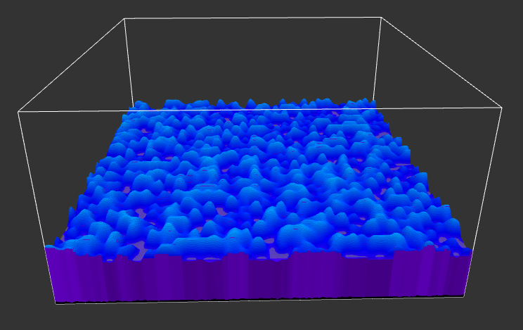

Getting there!  Next, let's make these hills larger by decreasing the frequency of the noise.  Find the perlin noise node, and lower its `frequency` value to somewhere around `0.200`.  The terrain should smooth out into nice rolling hills:

..center
  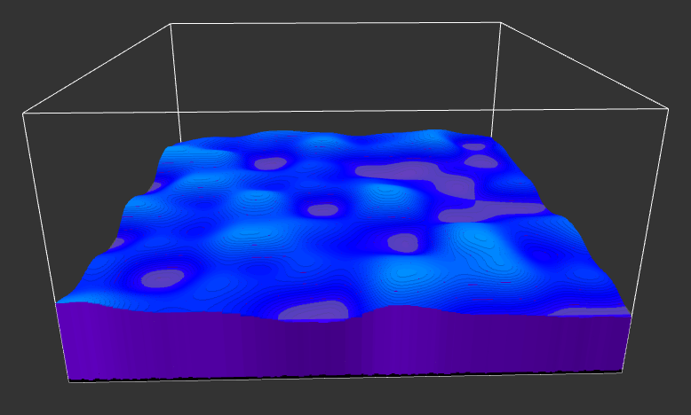

Nice.  Those are some smoooooth hills.  Perhaps a bit too smooth…

## More Realistic Hills

It'd definitely look better if those hills were less regular.  We can make that happen by mixing in _more noise_ (yo dawg) to our heightmap.  One of the best ways of accomplishing that is via a fractal noise function.

Press the grey "+ Fractal (2D)" button in the menu to add a fractal noise node.  This noise node takes _another_ noise node as its input, and allows you to mix that noise at various scales.  Let's wire our Perlin noise up to it.

Remove the connection between the heightmap and perlin nodes by ctrl clicking either the input or output of the connection.  Then, connect the perlin node to the fractal node's input, and connect the fractal node to the heightmap's input.  You should have something like this:

..center
  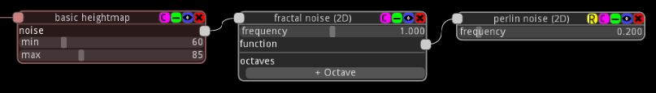

If you still have the terrain preview window up, it will have completely flattend out - don't worry!  We need to configure the fractal noise next.  Click on the grey "+ Octave" button at the bottom of the fractal noise node.  Ahh, there's your terrain again.  But wait, it isn't any different, what gives?

### Fractal Octaves

Fractal noise is composed of multiple _octaves_ of its input noise.  Each octave sums together to generate a new noise value.  The `scale` determines how tightly packed the input noise is at that octave (e.g. frequency).

In order to make more believable terrain, we want it to be mostly rolling hills, but we also want smaller random details on each hill.  Add two more octaves to the fractal noise node.  Configure your three octaves so that one is at a `scale` of around `1.0` and multiplier of `0.7`, the second with a scale of `2.0` and multiplier `0.2`, and the third with a `scale` of `4.0` and multiplier of `0.1`.  It's ok if they're not exact.  However, do try to get the multipliers to add up to `1.0`, or as close as you can.  Something like:

..center
  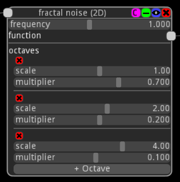

These octaves effectively say:

* I want mostly rolling hills (`scale`: `1.0`, `multiplier`: `0.7`)…
* …some medium-sized bumps (`scale`: `2.0`, `multiplier`: `0.2`)…
* …and a bunch of smaller bumps all over (`scale`: `4.0`, `multiplier`: `0.1`).

Take a look at the terrain preview, it should look much more believable now:

..center
  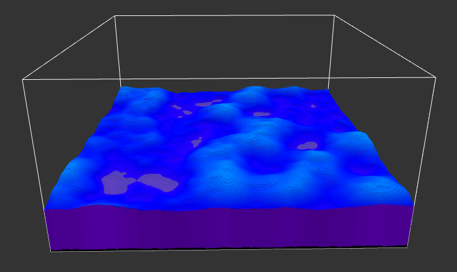

# Previewing In Game

Whew!  That's a pretty decent start.  But, before we conclude this tutorial, let's take a look at how this looks in the actual game.  Unfortunately, due to how Steam works, this can be a bit confusing.

First, save your world!  We're going to have to close the world builder, because Steam doesn't let you launch the game while it is running.  Go ahead and do so.

Thankfully, we can launch the world builder in a way that Steam doesn't complain about.  In your Steam library, right click on Boundless, and select "Properties".  Then, navigate to the "Local Files" tab.  Click on "Browse Local Files" to open up the directory Boundless was installed into.

From the Boundless directory, navigate into the "mave" directory, and start the program called "mave" (code name for the world builder).  It should start back up.  You will probably want to keep a shortcut around to this so that you can always launch the world builder this way.

Almost there!  Open your world back up.  Find the generator node, and click on the green eye icon next to "final world".  This will start a window that says "Started server (Final) @ ###.###.###.###:####".

Last step: Start Boundless.  Once the game loads, open up the menu and choose "Teleport To A World".  On the top of that menu, switch the universe from "Boundless" to "Builder".  Your world builder server should show up in the server list as "Final Mave - Quiet".  Connect to it!

..center
  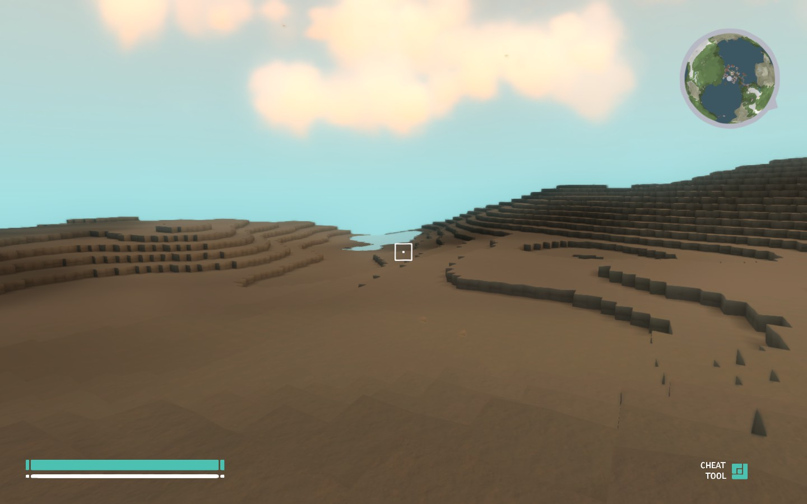

Great success!

# Up Next

That's it for this tutorial.  [In the next tutorial](/world-builder/guide/decorations), we will cover turning your biome into an actual forest!  There will be trees, grass, dir, sand, flowers, and all sorts of other goodies.
